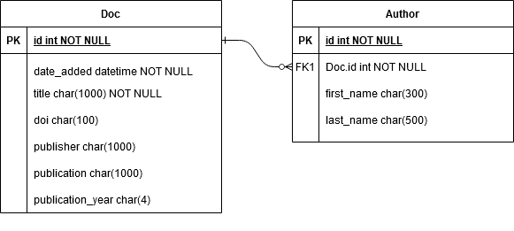

======================
Developer's Guide
======================

:author: Ryan Wolfslayer
:date: July 29, 2020  

.. contents::  

Overview
----------

Many libraries and information centers now offer an institutional repository to those in their host organization. These repositories allow researchers, associated with a given university, government agency, or think-tank, to disseminate working papers and early versions of their research. For those familiar with the open-access movement, institutional repositories are often key-players in freely distributing the most cutting-edge scholarship. Our library is associated with a government organization that employs over 200 Ph.D. economists, all of whom are encouraged to maintain an internal web page that pulls its data from our repository.
To add or edit their publication list, economists currently need to contact someone from our library staff and request the edits. The current system is inefficient for both sides of the exchange. On the one hand, economists need to already know or lookup who to contact to make updates. For the library, these email requests are often free-form and lack much of the metadata we require to make a full entry into the repository system. When emails are ambiguous, a librarian or contractor will need to research the economist, paper title, journal publisher, and more to come up with a complete record. During high-output times of the year, it is not unusual to see as many as 20 requests per day, each of which takes several minutes to prepare.

The aim of this product is two-fold. By creating a web-form, we can gently solicit the information we need from economists without overwhelming them with yet more paperwork. The human-computer interaction facilitated by this form should serve to remove ambiguity on both sides and pave the way for more opportunities to automate data entry.

**Why not other solutions?**

Our institution has a tightly controlled IT infrastructure and heavily discourages and prohibits the use of cloud-based solutions. Google forms, for example, is not an option; even if it were, we would likely need better access and control over how we present and access the collected data. Our environment already has a robust system of flask apps hosted on our intranet, and we can quickly set up a Postgresql database to store the form's output. I have a background in data and information modeling, so creating and maintaining a database is well within our capabilities.

Deployment
-----------

########
Local  
########

To run a local version of this app install the dependencies from requirements.txt.

.. code-block:: bash  

   $ pip install -r requirements.txt 

Next, run the main.py file to launch a Flask development server.  By default the server is localhost:5000

.. code-block:: bash  

   $ python main.py  

##################
Python Anywhere
##################

There is an instance of the webform hosted on PythonAnywhere. To view the example, `click here`_. 
For information on launching a Flask application on PythonAnywhere, view `this documentation`_.

.. _click here: http://wryan14.pythonanywhere.com/
.. _this documentation: https://help.pythonanywhere.com/pages/Flask/

When deploying this Flask application on any server, you will want to change the local_host variable (located at the toop of the app's __init__.py file to reflect the correct domain name).

For example change:

.. code-block:: python
   
   # app/__init__.py
   local_url = "http://localhost:5000"

to 

.. code-block:: python

   # app/__init__.py 
   # local_url = "http://localhost:5000"
   local_url = "http://wryan14.pythonanywhere.com"  

Project structure
-------------------

.. code-block:: bash

   .
   ├── LICENSE
   ├── README.md
   ├── app
   │   ├── __init__.py
   │   ├── forms.py
   │   ├── models.py
   │   ├── static
   │   ├── templates
   │   ├── utility.py
   │   └── views.py
   ├── config.py
   ├── main.py
   ├── requirements.txt
   ├── spec.md
   ├── tests
   │   ├── logs
   │   └── test_utility.py
   └── todos.md

###################
User interactions
###################

**Add new publication to repository**

   * The user arrives at the landing page and selects new publication
      * views.home
      * templates/welcome_page.html 
    
   * The user is provided the option to autopopulate the form using the publication's `DOI`_
      * views.newpub 
      * templates/newpub.html 
      * utitlity.CRef
      * forms.AuthorForm 
      * forms.NewPublication 

   * After autopopulating most of the form, the user can make minor edits or submit as is  
      * views.newpub 
      * templates.newpub
      
   * The data is stored in a database which will be queried by an automated system for review; the user is redirected to a success page
      * views.success_new 
      * templates/success_new.html 
      * models.Doc 
      * models.Author 

**Edit existing publication in repository**

   * The user arrives at the landing page and selects edit 
      * views.home 
      * templates/welcome_page.html

   * The user selects the desired publication from a table (possibly using the filter feature)
      * views.dash_app 
      * utility.cdm_pull
      * models.BeforeAuthor 
      * models.BeforeDoc 

   * After finding the publication, user hits edit and is redirected to an edit form that is prepopulated with metadata
      * views.editpub 
      * templates/editpub.html 

   * The user edits the desired field and is redirected to a success page that shows the recent changes
      * models.EditAuthor 
      * models.EditDoc 

   * Changes are stored in the database using tables that store the metadata before and after the edit  
      * views.success_edit 
      * templates/success_edit.html 
      
   * The database is queried and reviewed by an automated process 
      * models.BeforeAuthor 
      * models.EditAuthor 
      * models.BeforeDoc 
      * models.EditDoc

**Update forthcoming publication** [UNDER CONSTRUCTION]

   * The user arrives at the landng page and selects forthcoming
      * views.home
      * templates/welcome_page.html 

   * The user selects the desired publication from a table, using the table's filter function
      * [NEEDS BUILT]

   * After finding the publication, user is redirected to a form that gathers metadata
      * views.updatepub 
      * templates/updatepub.html 
      
   * The form is stored in a database and queried by an automated process
      * views.success_update 
      * templates/success_update.html 
      * [MODELS NEED BUILT]

.. _DOI: https://library.uic.edu/help/article/1966/what-is-a-doi-and-how-do-i-use-them-in-citations

App  
----

####################
Forms
####################

The forms are directly tied to the input fields within the templates. The following table should help you link the name of the form with the template name and output. 

+-------------------------+----------------------------+-----------------------------------+
| name                    | location(s)                | image                             |
+-------------------------+----------------------------+-----------------------------------+
| DOI Form                | * templates/newpub.html    | .. image:: _static/form1.png      |
|                         |                            |                                   |
+-------------------------+----------------------------+-----------------------------------+
| AuthorForm              | * forms.py                 | .. image:: _static/authorform.png |
|                         | * templates/newpub.html    |                                   |
|                         | * templates/editpub.html   |                                   |
|                         | * templates/updatepub.html |                                   |
+-------------------------+----------------------------+-----------------------------------+
| NewPublication          | * forms.py                 | .. image:: _static/form2.png      |
|                         | * templates/newpub.html    |                                   |
+-------------------------+----------------------------+-----------------------------------+
| UpdatePublication       | * forms.py                 | .. image:: _static/form3.png      |
|                         | * templates/editpub.html   |                                   |
+-------------------------+----------------------------+-----------------------------------+
| UpdatePublicationStatus | * forms.py                 | .. image:: _static/form4.png      |
|                         | * templates/updatepub.html |                                   |
+-------------------------+----------------------------+-----------------------------------+

.. automodule:: app.forms 
   :members:  
   :show-inheritance:

####################
Models
####################

The models determine how the database is structured. It is imporant to understand how the database is structured, so we can make proper SQL queries. 

**ER Diagrams**

These diagrams show a quick break down of the tables. Each document can have many authors, but, for now, authors can only have one document.
The connection between the BeforeDoc and EditDoc model is one-to-one, meaning the BeforeDoc can only have one EditDoc connection and visa versa. 

*New Publication model*

*Edit Publication model* 

.. image:: _static/EditDoc.png  
   :alt: ER diagram of EditDoc model

------------------------------------------------------------------------

**models.py**

.. automodule:: app.models 
  :members:  
  :show-inheritance:  

####################
Templates
####################

Templates use Jinja to create the HTML views used in the application.

+---------------------+-----------------------------------------------+--------------------------------------------+
| file                | description                                   | image                                      |
+---------------------+-----------------------------------------------+--------------------------------------------+
| base.html           | This template contains the navigation bar,    | .. image:: _static/base_html.png           |
|                     |                                               |                                            |
|                     | connects the JS and CSS to the project,       |                                            |
|                     |                                               |                                            |
|                     | and implements the JS script needed to        |                                            |
|                     |                                               |                                            |
|                     | adjust the number of authors per publication  |                                            |
|                     |                                               |                                            |
|                     | when editing records.                         |                                            |
+---------------------+-----------------------------------------------+--------------------------------------------+
| welcome_page.html   | Navigation page used to direct users to the   | .. image:: _static/welcome_html.png        |
|                     |                                               |                                            |
|                     | new, edit, and forthcoming processes.         |                                            |
+---------------------+-----------------------------------------------+--------------------------------------------+
| newpub.html         | Connects to                                   | .. image:: _static/newpub_html.png         |
|                     |                                               |                                            |
|                     | * view.py - newpub                            |                                            |
|                     |                                               |                                            |
|                     | * forms.py - AuthorForm and NewPublication    |                                            |
|                     |                                               |                                            |
|                     | * models.py - Doc and Author                  |                                            |
+---------------------+-----------------------------------------------+--------------------------------------------+
| editpub.html        | Connects to                                   | .. image:: _static/editpub_html.png        |
|                     |                                               |                                            |
|                     |                                               |                                            |
|                     | * views.py - editpub                          |                                            |
|                     |                                               |                                            |
|                     | * forms.py - AuthorForm and UpdatePublication |                                            |
|                     |                                               |                                            |
|                     | * models.py - BeforeAuthor, BeforeDoc         |                                            |
|                     |                                               |                                            |
|                     | * models.py - EditAuthor, EditDoc             |                                            |
+---------------------+-----------------------------------------------+--------------------------------------------+
| updatepub.html      | Connects to                                   | .. image:: _static/updatepub_html.png      |
|                     |                                               |                                            |
|                     |                                               |                                            |
|                     | * views.py - updatepub                        |                                            |
|                     |                                               |                                            |
|                     | * forms - updatepublicationstatus             |                                            |
|                     |                                               |                                            |
+---------------------+-----------------------------------------------+--------------------------------------------+
| __init__.py         | Combines components form the application,     | .. image:: _static/dash_table.png          |
|                     |                                               |                                            |
|                     | and allows for the app to be fully imported   |                                            |
|                     |                                               |                                            |
|                     | into main.py. This file also contains the     |                                            |
|                     |                                               |                                            |
|                     | dash table used to select records for edits.  |                                            |
+---------------------+-----------------------------------------------+--------------------------------------------+
| success_new.html    | Reads from                                    | .. image:: _static/success_new_html.png    |
|                     |                                               |                                            |
|                     |                                               |                                            |
|                     | * sqlite database                             |                                            |
|                     |                                               |                                            |
|                     | * models.py Doc and Author                    |                                            |
+---------------------+-----------------------------------------------+--------------------------------------------+
| success_edit.html   | Reads from                                    | .. image:: _static/success_edit_html.png   |
|                     |                                               |                                            |
|                     | * sqlite database                             |                                            |
|                     |                                               |                                            |
|                     | * models.py BeforeAuthor and BeforeDoc        |                                            |
|                     |                                               |                                            |
|                     | * models.py EditAuthor and EditDoc            |                                            |
|                     |                                               |                                            |
+---------------------+-----------------------------------------------+--------------------------------------------+
| success_update.html | Under construction                            | .. image:: _static/success_update_html.png |
+---------------------+-----------------------------------------------+--------------------------------------------+

####################
Utilities
####################

.. automodule:: app.utility
   :members:
   :show-inheritance:

####################
Views
####################

.. automodule:: app.views  
   :members:  
   :show-inheritance: